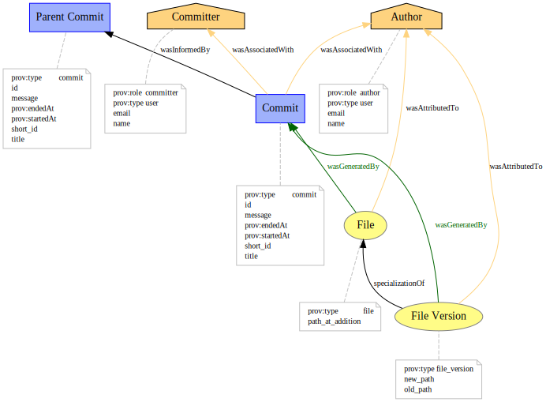
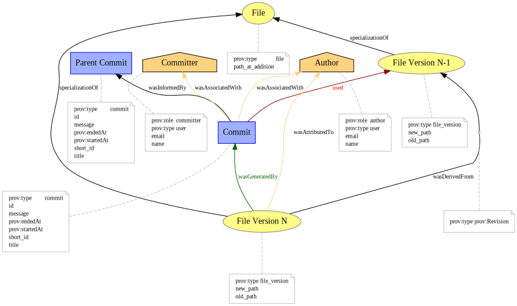
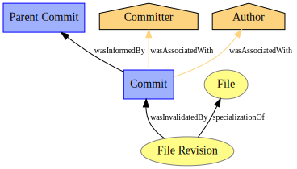
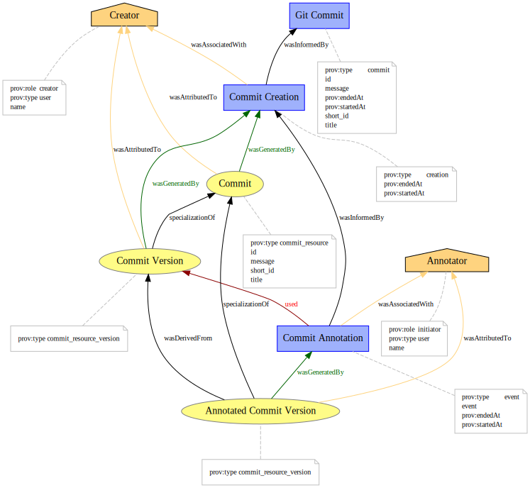
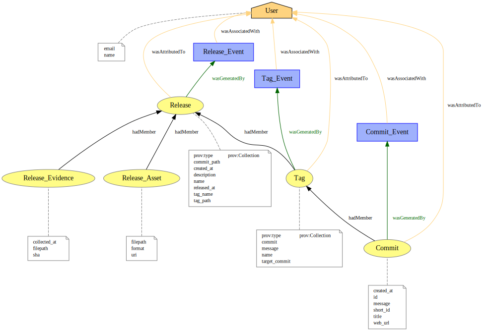
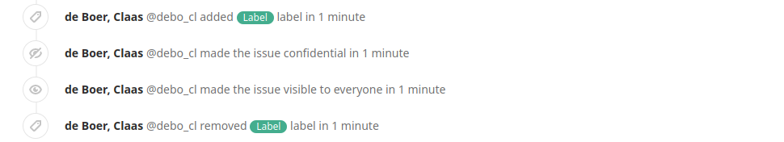

# `gitlab2prov` Provenance Graphs

### A Note on Figures
You can generate all figures in `json`, `provn`, `rdf`, `xml` or `dot` format.
Simply run the provided `figures.py` script.
For a quick setup use the provided `requirements.txt` to install all required packages.

```bash
pip install -r requirements.txt
```

## The GitLab2PROV Provenance Model
The provenance model for GitLab2PROV provenance graphs consists of multiple submodels, that are concerned with various types of interactions that users can have with a GitLab project aswell as with the `git` repository contained within the project.
A few models have been compiled without prior examples others are derivations of related projects such as `git2prov` or `github2prov`.

In total, the GitLab2PROV provenance model includes the following submodels:

1. **Git: Addition of a File**
2. **Git: Modification of a File**
3. **Git: Deletion of a File**
4. **GitLab: Commit Web Resource**
5. **GitLab: Issue Web Resource**
6. **GitLab: Merge Request Web Resource**
7. **GitLab: Release & Tag Resource**

This document contains a brief explanation for each model.
This includes, but is not limited to, a reference table for each PROV element of a model that defines which attributes are attached to the element.
Reference tables for qualified relations, i.e. relations that with attached attributes, are also provided.

This document uses the Cypher query language notation to denote relationships/relations.
The following ASCII art based notation represents a directed relation `r` of type `R` between the vertices `S` and `T`.

`(S)-[r:R]->(T)`

## Git: Addition of a File



This model captures the addition of a new file to the git repository of a GitLab project by a git commit.

The model includes all human actors involved in the process.
In this case these actors are the author and the committer of the git commit represented as agents in the model.
The author represents the user that originally wrote the code contained in the commit.
The committer represents the user that committed the code on behalf of the author.
Committer and author can be the same person but do not have to be.

The commit aswell as all of its parents are captured as activities.
Each commit is said to be informed by its parent commit, as each commit builds upon the git repository that the parent commits left behind.
The commit is associated to both author and committer as these are the actors responsible for its existance.

Two entities are created for the file that was added in the commit.
One, the File entity, represents the origin of the added file aswell as the concept of its originality.
The second entity, called FileRevision, represents the added file at the time of its addition.
The revision are marked as a specialization of the file origin.
Both entities are generated by the commit activity.
Both entities are attributed to the author of the commit, the actor responsible for their content and creation.


**`Author`**
| Attribute  | Fixed Value | Description                                              |
|------------|-------------|----------------------------------------------------------|
| name       | -           | `git config user.name` Set in the author's git config.   |
| email      | -           | `git config user.email` Set in the author's git config.  |
| prov:role  | Author      | Function of the agent in context of the commit activity. |
| prov:type  | User        | Agent type.                                              |
| prov:label | -           | Human readable representation of the agent.              |


**`Committer`**
| Attribute  | Fixed Value | Description                                              |
|------------|-------------|----------------------------------------------------------|
| name       | -           | `git config user.name` Set in the author's git config.   |
| email      | -           | `git config user.email` Set in the author's git config.  |
| prov:role  | Committer   | Function of the agent in context of the commit activity. |
| prov:type  | User        | Agent type.                                              |
| prov:label | -           | Human readable representation of the agent.              |


**`Commit`**
| Attribute      | Fixed Value             | Description                                 |
|----------------|-------------------------|---------------------------------------------|
| hexsha         | -                       | Commit SHA1                                 |
| message        | -                       | Commit message.                             |
| title          | -                       | First 50 characters of the commit message.  |
| prov:startTime | `COMMIT_AUTHOR_DATE`    | Time at which the commit activity started.  |
| prov:endTime   | `COMMIT_COMMITTER_DATE` | Time at which the commit activity ended.    |
| prov:type      | GitCommit               | Activity type.                              |
| prov:label     | -                       | Human readable representation of the agent. |


**`File`**
| Attribute     | Fixed Value | Description                                                        |
|---------------|-------------|--------------------------------------------------------------------|
| path          | -           | Original file path. The path at which this file was first created. |
| committed_in  | -           | SHA1 of the commit that added this file to the repository.         |
| prov:type     | File        | Entity type.                                                       |
| prov:label    | -           | Human readable representation of the entity.                       |


**`File Revision`**
| Attribute     | Fixed Value  | Description                                                                  |
|---------------|--------------|------------------------------------------------------------------------------|
| path          | -            | Current file path of this revision.                                          |
| committed_in  | -            | SHA1 of the commit that added this revision to the repository.               |
| change_type   | -            | [`git diff`](https://git-scm.com/docs/git-diff) change type / change status. |
| prov:type     | FileRevision | Entity type.                                                                 |
| prov:label    | -            | Human readable representation of the entity.                                 |


Some PROV relations in this model are "qualified" relations.
In simple terms: Some PROV relations have attributes attached to them.
The following tables define the attributes attached to these relations.


**`File - [wasGeneratedBy] -> Commit`**
| Attribute | Fixed Value          | Description                                                    |
|-----------|----------------------|----------------------------------------------------------------|
| prov:role | File                 | Function of the File entity in context of the Commit activity. |
| prov:time | `COMMIT_AUTHOR_DATE` | Time at which the File entity was generated.                   |


**`File Revision - [wasGeneratedBy] -> Commit`**
| Attribute | Fixed Value                   | Description                                                            |
|-----------|-------------------------------|------------------------------------------------------------------------|
| prov:role | FileRevisionAtPointOfAddition | Function of the FileRevision entity in context of the Commit activity. |
| prov:time | `COMMIT_AUTHOR_DATE`          | Time at which the FileRevision entity was generated.                   |


**`Commit - [wasAssociatedWith] -> Author`**
| Attribute | Fixed Value | Description                                                     |
|-----------|-------------|-----------------------------------------------------------------|
| prov:role | Author      | Function of the Author agent in context of the Commit activity. |


**`Commit - [wasAssociatedWith] -> Committer`**
| Attribute | Fixed Value | Description                                                        |
|-----------|-------------|--------------------------------------------------------------------|
| prov:role | Committer   | Function of the Committer agent in context of the Commit activity. |


## Git: Modification of a File



This model captures the modification of a file from the git repository of a GitLab project by a git commit.

The model includes all human actors involved in the process.
In this case these actors are the author and the committer of the git commit represented as agents in the model.
The author represents the user that originally wrote the code contained in the commit.
The committer represents the user that committed the code on behalf of the author.
Committer and author can be the same person but do not have to be.

The commit aswell as all of its parents are captured as activities.
Each commit is said to be informed by its parent commit, as each commit builds upon the git repository that the parent commits left behind.
The commit is associated to both author and committer as these are the actors responsible for its existance.
The commit uses the PreviousFileRevision to generate a new revision that accounts for the modifications included in the commit.

Three entities are created for the modified file.
One, the File entity, represents the origin of the file aswell as the concept of its originality.
The File entity will already exist, due to it being created in the 'Git: Addition of a File' model.
The second entity, called PreviousFileRevision, represents the latest file revision of the modified file before modification.
The third entity, called FileRevision, represents the revision of the file after the modification has been accounted for.
The FileRevision is said to be derived from the previous revision of the modified file.
The FileRevision is generated by the commit activity.
All revisions are marked as specializations of the File entity.


**`Author`**
| Attribute  | Fixed Value | Description                                              |
|------------|-------------|----------------------------------------------------------|
| name       | -           | `git config user.name` Set in the author's git config.   |
| email      | -           | `git config user.email` Set in the author's git config.  |
| prov:role  | Author      | Function of the agent in context of the commit activity. |
| prov:type  | User        | Agent type.                                              |
| prov:label | -           | Human readable representation of the agent.              |


**`Committer`**
| Attribute  | Fixed Value | Description                                              |
|------------|-------------|----------------------------------------------------------|
| name       | -           | `git config user.name` Set in the author's git config.   |
| email      | -           | `git config user.email` Set in the author's git config.  |
| prov:role  | Committer   | Function of the agent in context of the commit activity. |
| prov:type  | User        | Agent type.                                              |
| prov:label | -           | Human readable representation of the agent.              |


**`Commit`**
| Attribute      | Fixed Value             | Description                                 |
|----------------|-------------------------|---------------------------------------------|
| hexsha         | -                       | Commit SHA1                                 |
| message        | -                       | Commit message.                             |
| title          | -                       | First 50 characters of the commit message.  |
| prov:startTime | `COMMIT_AUTHOR_DATE`    | Time at which the commit activity started.  |
| prov:endTime   | `COMMIT_COMMITTER_DATE` | Time at which the commit activity ended.    |
| prov:type      | GitCommit               | Activity type.                              |
| prov:label     | -                       | Human readable representation of the activity. |


**`File`**
| Attribute     | Fixed Value | Description                                                        |
|---------------|-------------|--------------------------------------------------------------------|
| path          | -           | Original file path. The path at which this file was first created. |
| committed_in  | -           | SHA1 of the commit that added this file to the repository.         |
| prov:type     | File        | Entity type.                                                       |
| prov:label    | -           | Human readable representation of the entity.                       |


**`File Revision`**
| Attribute     | Fixed Value  | Description                                                                  |
|---------------|--------------|------------------------------------------------------------------------------|
| path          | -            | Current file path of this revision.                                          |
| committed_in  | -            | SHA1 of the commit that added this revision to the repository.               |
| change_type   | -            | [`git diff`](https://git-scm.com/docs/git-diff) change type / change status. |
| prov:type     | FileRevision | Entity type.                                                                 |
| prov:label    | -            | Human readable representation of the entity.                                 |


**`Previous File Revision`**
| Attribute     | Fixed Value  | Description                                                                  |
|---------------|--------------|------------------------------------------------------------------------------|
| path          | -            | Current file path of this revision.                                          |
| committed_in  | -            | SHA1 of the commit that added this revision to the repository.               |
| change_type   | -            | [`git diff`](https://git-scm.com/docs/git-diff) change type / change status. |
| prov:type     | FileRevision | Entity type.                                                                 |
| prov:label    | -            | Human readable representation of the entity.                                 |

Some PROV relations in this model are "qualified" relations.
In simple terms: Some PROV relations have attributes attached to them.
The following tables define the attributes attached to these relations.


**`Commit - [used] -> Previous File Revision`**
| Attribute | Fixed Value                    | Description                                                    |
|-----------|--------------------------------|----------------------------------------------------------------|
| prov:role | FileRevisionBeforeModification | Function of the File entity in context of the Commit activity. |
| prov:time | `COMMIT_AUTHOR_DATE`           | Time at which the File entity was used.                        |


**`File Revision - [wasGeneratedBy] -> Commit`**
| Attribute | Fixed Value                   | Description                                                    |
|-----------|-------------------------------|----------------------------------------------------------------|
| prov:role | FileRevisionAfterModification | Function of the File entity in context of the Commit activity. |
| prov:time | `COMMIT_AUTHOR_DATE`          | Time at which the File entity was generated.                   |


**`Commit - [wasAssociatedWith] -> Author`**
| Attribute | Fixed Value | Description                                                     |
|-----------|-------------|-----------------------------------------------------------------|
| prov:role | Author      | Function of the Author agent in context of the Commit activity. |


**`Commit - [wasAssociatedWith] -> Committer`**
| Attribute | Fixed Value | Description                                                        |
|-----------|-------------|--------------------------------------------------------------------|
| prov:role | Committer   | Function of the Committer agent in context of the Commit activity. |


## Git: Deletion of a File



This model captures the deletion of a file from the git repository of a GitLab project by a git commit.

The model includes all human actors involved in the process.
In this case these actors are the author and the committer of the git commit represented as agents in the model.
The author represents the user that originally wrote the code contained in the commit.
The committer represents the user that committed the code on behalf of the author.
Committer and author can be the same person but do not have to be.

The commit aswell as all of its parents are captured as activities.
Each commit is said to be informed by its parent commit, as each commit builds upon the git repository that the parent commits left behind.
The commit is associated to both author and committer, as these are the actors responsible for its existance.

Two entities are created for the deleted file.
One, the File entity, represents the origin of the file aswell as the concept of its originality.
The second, the FileRevision entity, represents the revision of the file at the point of its deletion.
The revision is invalidated by the commit that deletes / removes it from the repository.
The deleted revision is marked as a specialization of the original File entity.


**`Author`**
| Attribute  | Fixed Value | Description                                              |
|------------|-------------|----------------------------------------------------------|
| name       | -           | `git config user.name` Set in the author's git config.   |
| email      | -           | `git config user.email` Set in the author's git config.  |
| prov:role  | Author      | Function of the agent in context of the commit activity. |
| prov:type  | User        | Agent type.                                              |
| prov:label | -           | Human readable representation of the agent.              |


**`Committer`**
| Attribute  | Fixed Value | Description                                              |
|------------|-------------|----------------------------------------------------------|
| name       | -           | `git config user.name` Set in the author's git config.   |
| email      | -           | `git config user.email` Set in the author's git config.  |
| prov:role  | Committer   | Function of the agent in context of the commit activity. |
| prov:type  | User        | Agent type.                                              |
| prov:label | -           | Human readable representation of the agent.              |


**`Commit`**
| Attribute      | Fixed Value             | Description                                 |
|----------------|-------------------------|---------------------------------------------|
| hexsha         | -                       | Commit SHA1                                 |
| message        | -                       | Commit message.                             |
| title          | -                       | First 50 characters of the commit message.  |
| prov:startTime | `COMMIT_AUTHOR_DATE`    | Time at which the commit activity started.  |
| prov:endTime   | `COMMIT_COMMITTER_DATE` | Time at which the commit activity ended.    |
| prov:type      | GitCommit               | Activity type.                              |
| prov:label     | -                       | Human readable representation of the agent. |


**`File`**
| Attribute     | Fixed Value | Description                                                        |
|---------------|-------------|--------------------------------------------------------------------|
| path          | -           | Original file path. The path at which this file was first created. |
| committed_in  | -           | SHA1 of the commit that added this file to the repository.         |
| prov:type     | File        | Entity type.                                                       |
| prov:label    | -           | Human readable representation of the entity.                       |


**`File Revision`**
| Attribute     | Fixed Value  | Description                                                                  |
|---------------|--------------|------------------------------------------------------------------------------|
| path          | -            | Current file path of this revision.                                          |
| committed_in  | -            | SHA1 of the commit that added this revision to the repository.               |
| change_type   | -            | [`git diff`](https://git-scm.com/docs/git-diff) change type / change status. |
| prov:type     | FileRevision | Entity type.                                                                 |
| prov:label    | -            | Human readable representation of the entity.                                 |


Some PROV relations in this model are "qualified" relations.
In simple terms: Some PROV relations have attributes attached to them.
The following tables define the attributes attached to these relations.


**`Commit - [wasAssociatedWith] -> Author`**
| Attribute | Fixed Value | Description                                                     |
|-----------|-------------|-----------------------------------------------------------------|
| prov:role | Author      | Function of the Author agent in context of the Commit activity. |


**`Commit - [wasAssociatedWith] -> Committer`**
| Attribute | Fixed Value | Description                                                        |
|-----------|-------------|--------------------------------------------------------------------|
| prov:role | Committer   | Function of the Committer agent in context of the Commit activity. |


**`File Revision - [wasInvalidatedBy] -> Commit`**
| Attribute | Fixed Value                   | Description                                                            |
|-----------|-------------------------------|------------------------------------------------------------------------|
| prov:time | `COMMIT_AUTHOR_DATE`          | Time at which the FileRevision entity was invalidated.                 |
| prov:role | FileRevisionAtPointOfDeletion | Function of the FileRevision entity in context of the Commit activity. |


## GitLab: Commit Web Resource



This model captures the creation and annotation of a GitLab commit web resource, i.e. the webpage of a git commit as displayed by GitLab.

GitLab creates a webpage for a commit as soon as the commit is pushed to the GitLab remote.
Users can interact with the webpage by, among other interactions, leaving a comment in the comment section.
GitLab captures some of these interactions and stores them in internal data structures.
Comments written by users are therefore retrievable through the GitLab API.
Retrievable interactions such as comments are considered to "annotate" the web resource.

The model includes all human actors involved in the process of the creation or annotation of a GitLab commit web resource.
In this case these actors are the author of the GitLab commit web resource aswell as all users responsible for annotations.
The author represents the user that pushed the commit to the GitLab remote and consequently triggered the creation of the web resource.
An annotator is a user that is responsible for the existance of an annotation such as a comment.
In case of the annotation being a comment, the responsible annotator would be the author of the comment.

The creation of the web resource is captured as an activity.
The creation activity is informed by the corresponding git commit that triggered the creation of the commit web resource.
The creation activity is associated with the user that pushed the commit to the GitLab remote.
In the context of the creation activity, this user is called "Gitlab Commit Author".
Each annotation is captured as an activity that uses the latest version of the web resource to generate a new one.
Each annotation is associated with the user that is responsible for creating it.
Each annotation is informed by either the annotation that precedes it or - if no annotations have been recorded so far - the creation activity.
The annotations form a chain of events, that corresponds to the chain of interactions between users and the GitLab commit web resource.

The commit web resource is captured by multiple entities.
One for the original web resource and its concept of originality called "GitLab Commit".
A second one for the version of the GitLab commit web resource at the time of its creation, called "Commit Version".
One entity per annotation capturing the commit web resource right after the annotation happened, called "Annotated Commit Version".
The original web resource and the resource version at the point of creation is generated by the creation activity.
The original web resource and the first resource version are attributed to the gitlab commit author.
Each annotated commit version is generated by the corresponding annotation activity.
Each annotated commit version is attributed to its annotator.


**`Gitlab Commit Author`**
| Attribute  | Fixed Value        | Description                                              |
|------------|--------------------|----------------------------------------------------------|
| name       | -                  | `git config user.name` Set in the author's git config.   |
| email      | -                  | `git config user.email` Set in the author's git config.  |
| prov:role  | GitlabCommitAuthor | Function of the agent in context of the commit activity. |
| prov:type  | User               | Agent type.                                              |
| prov:label | -                  | Human readable representation of the agent.              |


**`Annotator`**
| Attribute       | Fixed Value | Description                                                    |
|-----------------|-------------|----------------------------------------------------------------|
| name            | -           | Annotator given name. As set in the annotators GitLab profile. |
| gitlab_username | -           | GitLab username. As set in the annotators GitLab profile.      |
| gitlab_id       | -           | Gitlab internal user id.                                       |
| prov:role       | Annotator   | Function of the agent in context of the commit activity.       |
| prov:type       | User        | Agent type.                                                    |
| prov:label      | -           | Human readable representation of the agent.                    |


**`Git Commit`**
| Attribute      | Fixed Value             | Description                                    |
|----------------|-------------------------|------------------------------------------------|
| hexsha         | -                       | Commit SHA1                                    |
| message        | -                       | Commit message.                                |
| title          | -                       | First 50 characters of the commit message.     |
| prov:startTime | `COMMIT_AUTHOR_DATE`    | Time at which the commit activity started.     |
| prov:endTime   | `COMMIT_COMMITTER_DATE` | Time at which the commit activity ended.       |
| prov:type      | GitCommit               | Activity type.                                 |
| prov:label     | -                       | Human readable representation of the activity. |


**`Creation`**
| Attribute      | Fixed Value             | Description                                     |
|----------------|-------------------------|-------------------------------------------------|
| creation_id    | -                       | SHA1 of the commit that triggered the creation. |
| prov:startTime | `COMMIT_COMMITTER_DATE` | Time at which the web resource was created.     |
| prov:endTime   | `COMMIT_COMMITTER_DATE` | Time at which the web resource was created.     |
| prov:type      | GitlabCommitCreation    | Activity type.                                  |
| prov:label     | -                       | Human readable representation of the activity.  |


**`Annotation`**
| Attribute      | Fixed Value | Description                                                                   |
|----------------|-------------|-------------------------------------------------------------------------------|
| id             | -           | Internal GitLab ID of the datastructure from which the annotation was parsed. |
| type           | -           | Annotation type. Parsed from the annotation body.                             |
| body           | -           | Annotation string. The string from which the type is parsed.                  |
| prov:startTime | -           | Time at which the annotation was created.                                     |
| prov:endTime   | -           | Time at which the annotation was created.                                     |
| prov:type      | Annotation  | Activity type.                                                                |
| prov:label     | -           | Human readable representation of the activity.                                |


The set of attributes for annotations can change according to the annotation type.
Annotations of type "assign_user" carry the attribute "user_name" which stores the name of the assigned user.
Other annotation types may have different additional attributes.
All recognized annotation types are listed in the "Annotations" section of this document.


**`Commit`**
| Attribute  | Fixed Value | Description                                           |
|------------|-------------|-------------------------------------------------------|
| hexsha     | -           | Commit SHA1.                                          |
| url        | -           | URL to the webpage of the gitlab commit web resource. |
| prov:type  | Resource    | Entity type.                                          |
| prov:label | -           | Human readable representation of the entity.          |


**`Commit Version`**
| Attribute  | Fixed Value               | Description                                  |
|------------|---------------------------|----------------------------------------------|
| version_id | -                         | Commit SHA1.                                 |
| prov:type  | ResourceAtPointOfAddition | Entity type.                                 |
| prov:label | -                         | Human readable representation of the entity. |


**`Annotated Commit Version`**
| Attribute     | Fixed Value              | Description                                  |
|---------------|--------------------------|----------------------------------------------|
| version_id    | -                        | Commit SHA1.                                 |
| annotation_id | -                        | Gitlab annotation id.                        |
| prov:type     | AnnotatedResourceVersion | Entity type.                                 |
| prov:label    | -                        | Human readable representation of the entity. |


Some PROV relations in this model are "qualified" relations.
In simple terms: Some PROV relations have attributes attached to them.
The following tables define the attributes attached to these relations.


**`Creation - [wasAssociatedWith] -> Gitlab Commit Author`**
| Attribute | Fixed Value        | Description                                                                   |
|-----------|--------------------|-------------------------------------------------------------------------------|
| prov:role | GitlabCommitAuthor | Function of the Gitlab Commit Author agent in context of the Commit activity. |


**` Annotation - [wasAssociatedWith] -> Annotator`**
| Attribute | Fixed Value | Description                                                        |
|-----------|-------------|--------------------------------------------------------------------|
| prov:role | Annotator   | Function of the Annotator agent in context of the Commit activity. |


**`Commit - [wasGeneratedBy] -> Creation`**
| Attribute | Fixed Value            | Description                                                      |
|-----------|------------------------|------------------------------------------------------------------|
| prov:role | GitlabCommitCreation   | Function of the Commit entity in context of the Commit activity. |
| prov:time | `COMMIT_COMMITER_DATE` | Time at which the Commit entity was generated.                   |


**`Commit Version - [wasGeneratedBy] -> Creation`**
| Attribute | Fixed Value            | Description                                                              |
|-----------|------------------------|--------------------------------------------------------------------------|
| prov:role | GitlabCommitVersion    | Function of the Commit Version entity in context of the Commit activity. |
| prov:time | `COMMIT_COMMITER_DATE` | Time at which the Commit Version entity was generated.                   |


**`Annotated Commit Version - [wasGeneratedBy] -> Creation`**
| Attribute | Fixed Value                  | Description                                                      |
|-----------|------------------------------|------------------------------------------------------------------|
| prov:role | AnnotatedGitlabCommitVersion | Function of the commit entity in context of the commit activity. |
| prov:time | -                            | Time at which the annotated commit version entity was generated. |


**`Annotated Commit Version - [used] -> Creation`**
| Attribute | Fixed Value                                       | Description                                                      |
|-----------|---------------------------------------------------|------------------------------------------------------------------|
| prov:role | AnnotatedGitlabCommitVersion, GitlabCommitVersion | Function of the commit entity in context of the commit activity. |
| prov:time | -                                                 | Time at which the annotated commit version entity was generated. |


## GitLab: Issue Web Resource


This model captures the creation and annotation of a GitLab issue web resource, i.e. the webpage of an issue as displayed by GitLab.

GitLab provides an issue tracker which is accessable through the GitLab API.
The GitLab: Issue Web Resource model is structurally similar to the GitLab: Commit Web Resource model.
The idea behind it is very similar aswell.

The model includes all human actors involved in the process of the creation or annotation of a gitlab issue web resource.
In this case the actors are the author of the gitlab issue web resource aswell as all users responsible for annotations.
The issue author represents the user that opened/created the issue in the first place.
An annotator is a user that is responsible for the existance of an annotation such as a comment, label, etc.
For example: In case of the annotation being a comment, the responsible annotator would be the author of the comment.

The creation of the web resource is captured as an activity.
The creation activity is associated with the user that opened/created the issue.
In the context of the creation activity, this user is called "Issue Author".
Each annotation is captured as an activity that uses the latest version of the web resource to generate a new one.
Each annotation is associated with the user that is responsible for creating it.
Each annotation is informed by either the annotation that precedes it or - if no annotations have been recorded so far - the creation activity.
The annotations form a chain of events, that corresponds to the chain of interactions between users and the gitlab issue web resource.

The issue web resource is captured by multiple entities.
One for the original web resource and its concept of originality called "Issue".
A second one for the version of the gitlab issue web resource at the time of its creation, called "Issue Version".
One entity per annotation capturing the issue web resource right after the annotation happened, called "Annotated Issue Version".
The original web resource and the resource version at the point of creation is generated by the creation activity.
The original web resource and the first resource version are attributed to the gitlab issue author.
Each annotated issue version is generated by the corresponding annotation activity.
Each annotated issue version is attributed to its annotator.


**`Issue Author`**
| Attribute       | Fixed Value | Description                                              |
|-----------------|-------------|----------------------------------------------------------|
| name            | -           | Author name. As set in the authors gitlab profile. |
| gitlab_username | -           | GitLab username. As set in the authors gitlab profile.   |
| gitlab_id       | -           | Gitlab internal user id.                                 |
| prov:role       | IssueAuthor | Function of the agent in context of the commit activity. |
| prov:type       | User        | Agent type.                                              |
| prov:label      | -           | Human readable representation of the agent.              |


**`Annotator`**
| Attribute       | Fixed Value | Description                                                    |
|-----------------|-------------|----------------------------------------------------------------|
| name            | -           | Annotator given name. As set in the annotators gitlab profile. |
| gitlab_username | -           | GitLab username. As set in the annotators gitlab profile.      |
| gitlab_id       | -           | Gitlab internal user id.                                       |
| prov:role       | Annotator   | Function of the agent in context of the commit activity.       |
| prov:type       | User        | Agent type.                                                    |
| prov:label      | -           | Human readable representation of the agent.                    |


**`Creation`**
| Attribute      | Fixed Value   | Description                                     |
|----------------|---------------|-------------------------------------------------|
| creation_id    | -             | Gitlab issue id. |
| prov:startTime | -             | Time at which the web resource was created.     |
| prov:endTime   | -             | Time at which the web resource was created.     |
| prov:type      | IssueCreation | Activity type.                                  |
| prov:label     | -             | Human readable representation of the activity.  |


**`Annotation`**
| Attribute      | Fixed Value | Description                                                                   |
|----------------|-------------|-------------------------------------------------------------------------------|
| id             | -           | Internal gitlab id of the datastructure from which the annotation was parsed. |
| type           | -           | Annotation type. Parsed from the annotation body.                             |
| body           | -           | Annotation string. The string from which the type is parsed.                  |
| prov:startTime | -           | Time at which the annotation was created.                                     |
| prov:endTime   | -           | Time at which the annotation was created.                                     |
| prov:type      | Annotation  | Activity type.                                                                |
| prov:label     | -           | Human readable representation of the activity.                                |


The set of attributes for annotations can change according to the annotation type.
Annotations of type "assign_user" carry the attribute "user_name" which stores the name of the assigned user.
Other annotation types may have different additional attributes.
All recognized annotation types are listed in the "Annotations" section of this document.


**`Issue`**
| Attribute   | Fixed Value | Description                                  |
|-------------|-------------|----------------------------------------------|
| id          | -           | Gitlab issue ID.                             |
| iid         | -           | Internal Gitlab issue ID.                    |
| title       | -           | Issue title.                                 |
| description | -           | Issue description.                           |
| url         | -           | URL to the gitlab issue.                     |
| created_at  | -           | Time at which the issue was created at.      |
| closed_at   | -           | Time at which the issue was closed at.       |
| prov:type   | Issue       | Entity type.                                 |
| prov:label  | -           | Human readable representation of the entity. |


**`Issue Version`**
| Attribute  | Fixed Value  | Description                                  |
|------------|--------------|----------------------------------------------|
| version_id | -            | Gitlab id of the issue.                      |
| prov:type  | IssueVersion | Entity type.                                 |
| prov:label | -            | Human readable representation of the entity. |


**`Annotated Issue Version`**
| Attribute     | Fixed Value           | Description                                                       |
|---------------|-----------------------|-------------------------------------------------------------------|
| version_id    | -                     | Gitlab id of the issue.                                           |
| annotation_id | -                     | Gitlab id of the annotation that generated the annotated version. |
| prov:type     | AnnotatedIssueVersion | Entity type.                                                      |
| prov:label    | -                     | Human readable representation of the entity.                      |


Some PROV relations in this model are "qualified" relations.
In simple terms: Some PROV relations have attributes attached to them.
The following tables define the attributes attached to these relations.


**`Creation - [wasAssociatedWith] -> Issue Author`**
| Attribute | Fixed Value | Description                                                             |
|-----------|-------------|-------------------------------------------------------------------------|
| prov:role | IssueAuthor | Function of the issue author agent in context of the creation activity. |


**`Annotation - [wasAssociatedWith] -> Annotator`**
| Attribute | Fixed Value | Description                                                            |
|-----------|-------------|------------------------------------------------------------------------|
| prov:role | Annotator   | Function of the annotator agent in context of the annotation activity. |


**`Issue - [wasGeneratedBy] -> Creation`**
| Attribute | Fixed Value | Description                                                       |
|-----------|-------------|-------------------------------------------------------------------|
| prov:role | Resource    | Function of the issue entity in context of the creation activity. |
| prov:time | -           | Time at which the issue entity was generated.                     |


**`Issue Version - [wasGeneratedBy] -> Creation`**
| Attribute | Fixed Value                      | Description                                                       |
|-----------|----------------------------------|-------------------------------------------------------------------|
| prov:role | ResourceVersionAtPointOfCreation | Function of the issue entity in context of the creation activity. |
| prov:time | -                                | Time at which the issue version entity was generated.             |


**`Annotated Issue Version - [wasGeneratedBy] -> Annotation`**
| Attribute | Fixed Value                    | Description                                                       |
|-----------|--------------------------------|-------------------------------------------------------------------|
| prov:role | ResourceVersionAfterAnnotation | Function of the issue entity in context of the creation activity. |
| prov:time | -                              | Time at which the annotated issue version entity was generated.   |


**`Annotation - [used] -> Issue Version`**
| Attribute | Fixed Value                  | Description                                                       |
|-----------|------------------------------|-------------------------------------------------------------------|
| prov:role | ResourceVersionToBeAnnotated | Function of the issue entity in context of the creation activity. |
| prov:time | -                            | Time at which the issue version entity was generated.             |


## GitLab: Merge Request Web Resource


This model captures the creation and annotation of a GitLab merge request web resource, i.e. the webpage of a merge request as displayed by GitLab.

The GitLab: Merge Request Web Resource model is structurally similar to the GitLab: Commit Web Resource model.
The idea behind it is very similar aswell.

The model includes all human actors involved in the process of the creation or annotation of a gitlab merge request web resource.
In this case the actors are the author of the gitlab merge request web resource aswell as all users responsible for annotations.
The issue author represents the user that opened/created the merge request in the first place.
An annotator is a user that is responsible for the existance of an annotation such as a comment, label, etc.
For example: In case of the annotation being a comment, the responsible annotator would be the author of the comment.

The creation of the web resource is captured as an activity.
The creation activity is associated with the user that opened/created the merge request.
In the context of the creation activity, this user is called "Merge Request Author".
Each annotation is captured as an activity that uses the latest version of the web resource to generate a new one.
Each annotation is associated with the user that is responsible for creating it.
Each annotation is informed by either the annotation that precedes it or - if no annotations have been recorded so far - the creation activity.
The annotations form a chain of events, that corresponds to the chain of interactions between users and the gitlab merge request web resource.

The merge request web resource is captured by multiple entities.
One for the original web resource and its concept of originality called "Merge Request".
A second one for the version of the gitlab merge request web resource at the time of its creation, called "Merge Request Version".
One entity per annotation capturing the merge request web resource right after the annotation happened, called "Annotated Merge Request Version".
The original web resource and the resource version at the point of creation is generated by the creation activity.
The original web resource and the first resource version are attributed to the gitlab merge request author.
Each annotated merge request version is generated by the corresponding annotation activity.
Each annotated merge request version is attributed to its annotator.


**`Merge Request Author`**
| Attribute       | Fixed Value        | Description                                                     |
|-----------------|--------------------|-----------------------------------------------------------------|
| name            | -                  | Author name. As set in the authors GitLab profile.              |
| gitlab_username | -                  | GitLab username. As set in the authors GitLab profile.          |
| gitlab_id       | -                  | Gitlab user id.                                                 |
| prov:role       | MergeRequestAuthor | Function of the agent in context of the merge request activity. |
| prov:type       | User               | Agent type.                                                     |
| prov:label      | -                  | Human readable representation of the agent.                     |


**`Annotator`**
| Attribute       | Fixed Value | Description                                                     |
|-----------------|-------------|-----------------------------------------------------------------|
| name            | -           | Annotator given name. As set in the annotators GitLab profile.  |
| gitlab_username | -           | GitLab username. As set in the annotators GitLab profile.       |
| gitlab_id       | -           | Gitlab user id.                                                 |
| prov:role       | Annotator   | Function of the agent in context of the merge request activity. |
| prov:type       | User        | Agent type.                                                     |
| prov:label      | -           | Human readable representation of the agent.                     |


**`Creation`**
| Attribute      | Fixed Value          | Description                                    |
|----------------|----------------------|------------------------------------------------|
| creation_id    | -                    | Gitlab merge request id.                       |
| prov:startTime | -                    | Time at which the web resource was created.    |
| prov:endTime   | -                    | Time at which the web resource was created.    |
| prov:type      | MergeRequestCreation | Activity type.                                 |
| prov:label     | -                    | Human readable representation of the activity. |


**`Annotation`**
| Attribute      | Fixed Value | Description                                                                   |
|----------------|-------------|-------------------------------------------------------------------------------|
| id             | -           | Internal gitLab id of the datastructure from which the annotation was parsed. |
| type           | -           | Annotation type. Parsed from the annotation body.                             |
| body           | -           | Annotation string. The string from which the type is parsed.                  |
| prov:startTime | -           | Time at which the annotation was created.                                     |
| prov:endTime   | -           | Time at which the annotation was created.                                     |
| prov:type      | Annotation  | Activity type.                                                                |
| prov:label     | -           | Human readable representation of the activity.                                |


The set of attributes for annotations can change according to the annotation type.
Annotations of type "assign_user" carry the attribute "user_name" which stores the name of the assigned user.
Other annotation types may have different additional attributes.
All recognized annotation types are listed in the "Annotations" section of this document.


**`Merge Request`**
| Attribute                       | Fixed Value  | Description                                                       |
|---------------------------------|--------------|-------------------------------------------------------------------|
| id                              | -            | Gitlab merge request id.                                          |
| iid                             | -            | Internal gitlab merge request id.                                 |
| title                           | -            | Issue title.                                                      |
| description                     | -            | Issue description.                                                |
| url                             | -            | URL to the gitlab issue.                                          |
| source_branch                   | -            | Merge request source branch name.                                 |
| target_branch                   | -            | Merge request target branch name.                                 |
| created_at                      | -            | Time at which the merge request was created at.                   |
| closed_at                       | -            | Time at which the merge request was closed at.                    |
| merged_at                       | -            | Time at which the merge request was merged at.                    |
| first_deployed_to_production_at | -            | Time at which the merge request was first deployed to production. |
| prov:type                       | MergeRequest | Entity type.                                                      |
| prov:label                      | -            | Human readable representation of the entity.                      |


**`Merge Request Version`**
| Attribute  | Fixed Value               | Description                                  |
|------------|---------------------------|----------------------------------------------|
| version_id | -                         | Gitlab id of the merge request.              |
| prov:type  | GitlabMergeRequestVersion | Entity type.                                 |
| prov:label | -                         | Human readable representation of the entity. |


**`Annotated Merge Request Version`**
| Attribute     | Fixed Value                  | Description                                                       |
|---------------|------------------------------|-------------------------------------------------------------------|
| version_id    | -                            | Gitlab id of the merge request.                                   |
| annotation_id | -                            | Gitlab id of the annotation that generated the annotated version. |
| prov:type     | AnnotatedMergeRequestVersion | Entity type.                                                      |
| prov:label    | -                            | Human readable representation of the entity.                      |


Some PROV relations in this model are "qualified" relations.
In simple terms: Some PROV relations have attributes attached to them.
The following tables define the attributes attached to these relations.


**`Creation - [wasAssociatedWith] -> Merge Request Author`**
| Attribute | Fixed Value | Description                                                             |
|-----------|-------------|-------------------------------------------------------------------------|
| prov:role | IssueAuthor | Function of the merge request author agent in context of the creation activity. |


**`Annotation - [wasAssociatedWith] -> Annotator`**
| Attribute | Fixed Value | Description                                                            |
|-----------|-------------|------------------------------------------------------------------------|
| prov:role | Annotator   | Function of the annotator agent in context of the annotation activity. |


**`Merge Request - [wasGeneratedBy] -> Creation`**
| Attribute | Fixed Value | Description                                                               |
|-----------|-------------|---------------------------------------------------------------------------|
| prov:role | Resource    | Function of the merge request entity in context of the creation activity. |
| prov:time | -           | Time at which the merge request entity was generated.                     |


**`Merge Request Version - [wasGeneratedBy] -> Creation`**
| Attribute | Fixed Value                      | Description                                                               |
|-----------|----------------------------------|---------------------------------------------------------------------------|
| prov:role | ResourceVersionAtPointOfCreation | Function of the merge request entity in context of the creation activity. |
| prov:time | -                                | Time at which the merge request version entity was generated.             |


**`Annotated Merge Request Version - [wasGeneratedBy] -> Annotation`**
| Attribute | Fixed Value                    | Description                                                               |
|-----------|--------------------------------|---------------------------------------------------------------------------|
| prov:role | ResourceVersionAfterAnnotation | Function of the merge request entity in context of the creation activity. |
| prov:time | -                              | Time at which the annotated merge request version entity was generated.   |


**`Annotation - [used] -> Merge Request Version`**
| Attribute | Fixed Value                  | Description                                                               |
|-----------|------------------------------|---------------------------------------------------------------------------|
| prov:role | ResourceVersionToBeAnnotated | Function of the merge request entity in context of the creation activity. |
| prov:time | -                            | Time at which the merge request version entity was generated.             |


## GitLab: Release & Tag Resource



This model captures the creation of gitlab releases and tags.

The model includes all human actors involved in the process of the creation of a release of tag.
In this case the actors are the author of the release, the author of the tag and the author of the git commit that pushed the tag.

The creation of a release is captured as an activity called "Release Creation".
The creation of a tag  is captured as an activity called "Tag Creation".
The creation of a commit is captured as an activity called "Commit Creation".
The release creation is associated with the author responsible for the release.
The tag creation is associated with the author responsible for the tag.
The commit creation is associated with the git commit author.

An entity is created for each release, tag and commit.
The tag and release entities are considered to be a `prov:Collection`.
Each gitlab release includes multiple asset files aswell as a release evidence file.
Each such file is captured in an entity.
The release is generated by the release creation activity.
The tag is generated by the tag creation activity.
The commit is generated by the commit creation activity.


**`Asset`**
| Attribute  | Fixed Value | Description                                  |
|------------|-------------|----------------------------------------------|
| url        | -           | Asset URL.                                   |
| format     | -           | Asset format.                                |
| prov:type  | Asset       | Entity type.                                 |
| prov:label | -           | Human readable representation of the entity. |


**`Evidence`**
| Attribute    | Fixed Value | Description                                  |
|--------------|-------------|----------------------------------------------|
| hexsha       | -           | Evidence SHA.                                |
| url          | -           | Evidence URL.                                |
| collected_at | -           | Time at which the evidence was generated.    |
| prov:type    | Asset       | Entity type.                                 |
| prov:label   | -           | Human readable representation of the entity. |


**`Commit`**
| Attribute  | Fixed Value | Description                                  |
|------------|-------------|----------------------------------------------|
| hexsha     | -           | Commit SHA1                                  |
| message    | -           | Commit message.                              |
| title      | -           | First 50 characters of the commit message.   |
| prov:type  | GitCommit   | Entity type.                                 |
| prov:label | -           | Human readable representation of the entity. |


**`Tag`**
| Attribute  | Fixed Value     | Description                                       |
|------------|-----------------|---------------------------------------------------|
| name       | -               | Tag name.                                         |
| hexsha     | -               | Commit SHA1 of the commit that pushed the tag.    |
| message    | -               | Commit message of the commit that pushed the tag. |
| created_at | -               | Time at which the tag was created.                |
| prov:type  | Tag             | Entity type.                                      |
| prov:type  | prov:Collection | Entity type.                                      |
| prov:label | -               | Human readable representation of the entity.    |


**`Release`**
| Attribute   | Fixed Value     | Description                                    |
|-------------|-----------------|------------------------------------------------|
| name        | -               | Release name.                                  |
| description | -               | Release description.                           |
| tag_name    | -               | Release tag name.                              |
| created_at  | -               | Time at which the release was created.         |
| released_at | -               | Time at which the release was released.        |
| prov:type   | Tag             | Entity type.                                   |
| prov:type   | prov:Collection | Entity type.                                   |
| prov:label  | -               | Human readable representation of the entity. |


**`Commit Author`**
| Attribute  | Fixed Value | Description                                              |
|------------|-------------|----------------------------------------------------------|
| name       | -           | `git config user.name` Set in the author's git config.   |
| email      | -           | `git config user.email` Set in the author's git config.  |
| prov:role  | Author      | Function of the agent in context of the commit activity. |
| prov:type  | User        | Agent type.                                              |
| prov:label | -           | Human readable representation of the agent.              |


**`Tag Author`**
| Attribute  | Fixed Value | Description                                                    |
|------------|-------------|----------------------------------------------------------------|
| name       | -           | `git config user.name` Set in the author's git config.         |
| email      | -           | `git config user.email` Set in the author's git config.        |
| prov:role  | Author      | Function of the agent in context of the tag creation activity. |
| prov:type  | User        | Agent type.                                                    |
| prov:label | -           | Human readable representation of the agent.                    |


**`Release Author`**
| Attribute       | Fixed Value   | Description                                                                                      |
|-----------------|---------------|--------------------------------------------------------------------------------------------------|
| name            | -             | Author name. As set in the authors GitLab profile. Only available if the token has admin rights. |
| email           | -             | Author email. Set in the author's git config. Only available if the token has admin rights.      |
| gitlab_username | -             | GitLab username. As set in the authors GitLab profile.                                           |
| gitlab_id       | -             | Gitlab user id.                                                                                  |
| prov:role       | ReleaseAuthor | Function of the agent in context of the release creation activity.                               |
| prov:type       | User          | Agent type.                                                                                      |
| prov:label      | -             | Human readable representation of the agent.                                                      |


**`Commit Creation`**
| Attribute      | Fixed Value    | Description                                    |
|----------------|----------------|------------------------------------------------|
| creation_id    | -              | Commit SHA1.                                   |
| prov:startTime | -              | Time at which the commit was created.          |
| prov:endTime   | -              | Time at which the commit was created.          |
| prov:type      | CommitCreation | Activity type.                                 |
| prov:label     | -              | Human readable representation of the activity. |


**`Tag Creation`**
| Attribute      | Fixed Value | Description                                    |
|----------------|-------------|------------------------------------------------|
| creation_id    | -           | Tag name.                                      |
| prov:startTime | -           | Time at which the tag was created.             |
| prov:endTime   | -           | Time at which the tag was created.             |
| prov:type      | TagCreation | Activity type.                                 |
| prov:label     | -           | Human readable representation of the activity. |


**`Release Creation`**
| Attribute      | Fixed Value     | Description                                    |
|----------------|-----------------|------------------------------------------------|
| creation_id    | -               | Tag name.                                      |
| prov:startTime | -               | Time at which the release was created.         |
| prov:endTime   | -               | Time at which the release was realeased.       |
| prov:type      | ReleaseCreation | Activity type.                                 |
| prov:label     | -               | Human readable representation of the activity. |


Some PROV relations in this model are "qualified" relations.
In simple terms: Some PROV relations have attributes attached to them.
The following tables define the attributes attached to these relations.


**`Release Creation - [wasAssociatedWith] -> Release Author`**
| Attribute | Fixed Value | Description                                                             |
|-----------|-------------|-------------------------------------------------------------------------|
| prov:role | ReleaseAuthor | Function of the merge request author agent in context of the creation activity. |


**`Tag Creation - [wasAssociatedWith] -> Tag Author`**
| Attribute | Fixed Value | Description                                                             |
|-----------|-------------|-------------------------------------------------------------------------|
| prov:role | TagAuthor | Function of the merge request author agent in context of the creation activity. |


**`Commit Creation - [wasAssociatedWith] -> Commit Author`**
| Attribute | Fixed Value | Description                                                             |
|-----------|-------------|-------------------------------------------------------------------------|
| prov:role | Author | Function of the merge request author agent in context of the creation activity. |


**`Release - [wasGeneratedBy] -> Release Creation`**
| Attribute | Fixed Value | Description                                                                 |
|-----------|-------------|-----------------------------------------------------------------------------|
| prov:role | Release     | Function of the release entity in context of the release creation activity. |
| prov:time | -           | Time at which the release entity was generated.                             |


**`Tag - [wasGeneratedBy] -> Tag Creation`**
| Attribute | Fixed Value | Description                                                         |
|-----------|-------------|---------------------------------------------------------------------|
| prov:role | Tag         | Function of the tag entity in context of the tag creation activity. |
| prov:time | -           | Time at which the tag entity was generated.                         |


**`Commit - [wasGeneratedBy] -> Commit Creation`**
| Attribute | Fixed Value | Description                                                               |
|-----------|-------------|---------------------------------------------------------------------------|
| prov:role | Tag         | Function of the commit entity in context of the commit creation activity. |
| prov:time | -           | Time at which the commit entity was generated.                            |


## Annotations

GitLab displays annotations that occur on resources on the webpages of the respective resources.
For example, if a resource was mentioned in the comment thread of another resource, this mention is displayed in the comment section of the mentioned target.



These annotations can be parsed from multiple sources that are provided by the official GitLab API.
Sadly there is no dedicated endpoint for all annotations that are of interest.
Especially annotations that connect resources are difficult to get.
Here a quick summary of what data needs to be retrieved, how to parse it and the workarounds that we deployed to achieve annotation parsing.

For label events we use the official API endpoint from which we parse the appropriate annotations ("add_label", "remove_label").
Emoji awards can be retrieved from the appropriate API endpoint.
We parse everything else - such as mentions, time tracking stats, due dates, TODO's, etc. - from system notes that GitLab uses to display annotations in their web-interface.

System notes include a string that describe the annotation that they represent.
We classify the annotation that the string denotes using regular expressions.
If necessary we include named groups in the regular expressions to extract relevant information from the annotation strings.
These are later added to PROV element attributes.

Noted, this is not optimal as older GitLab versions employ different string notations for the same annotation.
Sometimes only differing by a few characters and other times having a completly different string for the same annotation.
In addition there is a problem when parsing imported projects.
For example, while parsing a project that was imported from SVN, relevant annotations wheren't recorded as system notes but rather as normal notes.
This is not accounted for and is - as of right now - not covered by the current note parsing approach.

Here a list of annotations that we are currently able to parse with a short description of what the annotation is and the API resource from which we parse that annotation.

### List of Annotations

| Annotation Type                     | Description                                                                | Parsed API Resource |
|-------------------------------------|----------------------------------------------------------------------------|---------------------|
| `remove_label`                      | Removed label from a resource.                                             | Label Event         |
| `add_label`                         | Added label to a resource.                                                 | Label Event         |
| `award_emoji`                       | Awarded emoji to a resource or note.                                       | Award Emoji         |
| `comment`                           | Note added to the discussion thread of the resource.                       | Note                |
| `change_epic`                       | Exchanged epic that was attached to resource for another one.              | System Note         |
| `remove_from_external_epic`         | Remove resource from an epic that stems from another project.              | System Note         |
| `add_to_external_epic`              | Resource was added to an epic that belongs to another project.             | System Note         |
| `remove_from_epic`                  | Resource was removed from an epic of the same project.                     | System Note         |
| `add_to_epic`                       | Resource was added to an epic of the same project.                         | System Note         |
| `close_by_external_commit`          | Closeable Resource was closed by a commit from another project.            | System Note         |
| `close_by_external_merge_request`   | Closeable resource was closed by a merge request from another project.     | System Note         |
| `close_by_merge_request`            | Closeable resource was closed by a merge request from the same project.    | System Note         |
| `close_by_commit`                   | Closeable resource was closed by a commit from the same project.           | System Note         |
| `restore_source_branch`             | TODO: what is this event?                                                  | System Note         |
| `remove_label`                      | Removed label from a resource.                                             | System Note         |
| `add_label`                         | Added label to a resource.                                                 | System Note         |
| `create_branch`                     | Created branch for a merge request.                                        | System Note         |
| `mark_task_as_incomplete`           | Unchecked a checked (completed) task.                                      | System Note         |
| `mark_task_as_done`                 | Checked an uncompleted taks. This marks the task as done.                  | System Note         |
| `add_commits`                       | Added commits to a merge request.                                          | System Note         |
| `address_in_merge_request`          | Created a merge request from the commen thread of an issue.                | System Note         |
| `unmark_as_work_in_progress`        | Reset the WIP status of a resource. (issues, merge requests)               | System Note         |
| `mark_as_work_in_progress`          | Set the status of a resource to WIP. (issues, merge requests)              | System Note         |
| `merge`                             | Merged a merge request.                                                    | System Note         |
| `change_description`                | Changed the description of a resource. (issues, merge requests)            | System Note         |
| `change_title`                      | Changed the title of a resource. (issues, merge requests)                  | System Note         |
| `move_from`                         | Moved issue from another project to this project.                          | System Note         |
| `move_to`                           | Moved issue from this project to another project.                          | System Note         |
| `reopen`                            | Reopened a closeable resource.                                             | System Note         |
| `close`                             | Closed a closeable resource.                                               | System Note         |
| `unrelate_from_external_issue`      | Removed relation to an issue from another project.                         | System Note         |
| `relate_to_external_issue`          | Added relation to an issue from another project.                           | System Note         |
| `unrelate_from_issue`               | Removed relation to issue of the same project.                             | System Note         |
| `relate_to_issue`                   | Added relation to issue of the same project.                               | System Note         |
| `has_duplicate`                     | Mark another issue as a duplicate of this issue.                           | System Note         |
| `mark_as_duplicate`                 | Mark this issue as a duplicate of another issue.                           | System Note         |
| `make_visible`                      | Set the visibility status of the resource to unconfidential.               | System Note         |
| `make_confidential`                 | Set the visibility status of the resource to confidential.                 | System Note         |
| `remove_weight`                     | Removed the set weight of the resource.                                    | System Note         |
| `change_weight`                     | Changed the weight of a resource.                                          | System Note         |
| `remove_due_date`                   | Removed the due date of the resource.                                      | System Note         |
| `change_due_date`                   | Changed the due date of the resource.                                      | System Note         |
| `remove_time_estimate`              | Removed the time estimate value of the resource.                           | System Note         |
| `change_time_estimate`              | Changed the time estimate value of the resource.                           | System Note         |
| `unlock_merge_request`              | Unlocked the discussion thread of the merge request. (Enable comments)     | System Note         |
| `lock_merge_request`                | Locked the discussion thread of the merge request. (Disable comments)      | System Note         |
| `unlock_issue`                      | Unlocked the discussion thread of the issue. (Enable comments)             | System Note         |
| `lock_issue`                        | Locked the discussion thread of the issue. (Disable comments)              | System Note         |
| `remove_spend_time`                 | Removed time tracking stats from the resource.                             | System Note         |
| `subtract_spend_time`               | Subtracted an amount of time from the time tracking stats of the resource. | System Note         |
| `add_spend_time`                    | Added an amount of time to the time tracking stats of the resource.        | System Note         |
| `remove_milestone`                  | Removed milestone from the resource.                                       | System Note         |
| `change_milestone`                  | Changed milestone that was given to the resource to another milestone.     | System Note         |
| `unassign_user`                     | Unassigned a user from the assignable resource.                            | System Note         |
| `assign_user`                       | Assigned a user to the assignable resource.                                | System Note         |
| `mention_in_external_merge_request` | Mentioned the resource in a merge request from another project.            | System Note         |
| `mention_in_merge_request`          | Mentioned the resource in a merge request from the same project.           | System Note         |
| `mention_in_external_commit`        | Mentioned the resource in a commit from another project.                   | System Note         |
| `mention_in_commit`                 | Mentioned the resource in a commit from the same project.                  | System Note         |
| `mention_in_external_issue`         | Mentioned the resource in an issue from another project.                   | System Note         |
| `mention_in_issue`                  | Mentioned the resource in an issue from the same project.                  | System Note         |
