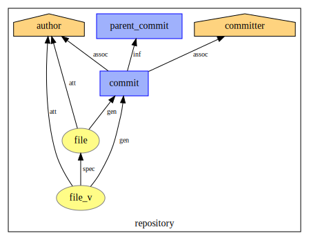
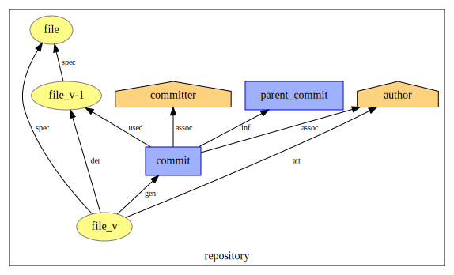
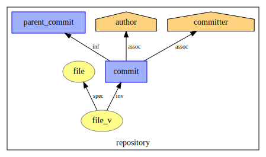
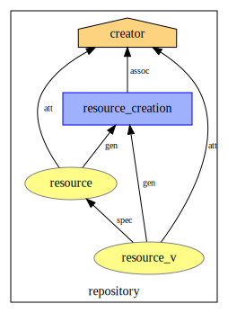
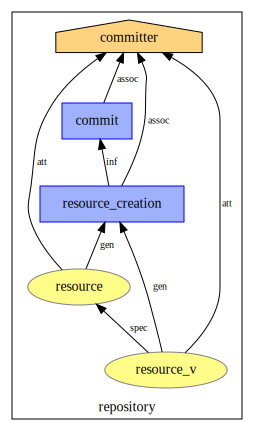
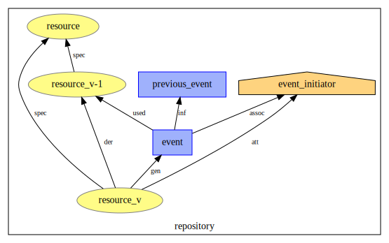

# Provenance Models

### Brew your own plots.
You can generate all figures that are displayed in the **Models** section by yourself and in a format of your desire.

Simply run the provided `plot.py` script with the necessary flags/arguments.
You will need to install the python package `prov`. For a quick setup run:

```bash
pip install -r requirements.txt
```

Usage of `plot.py`:
```bash
❯ python plot.py -h
usage: plot.py [-h] [--format FORMAT] directory

Plot PROV models.

positional arguments:
  directory        output file directory

optional arguments:
  -h, --help       show this help message and exit
  --format FORMAT  output format (default .svg)
```

**Example**

```bash
❯ python plot.py --format=pdf pdfs/
Plotting: pdfs/commit-add-file.pdf
Plotting: pdfs/commit-modify-file.pdf
Plotting: pdfs/commit-delete-file.pdf
Plotting: pdfs/resource-creation-commit.pdf
Plotting: pdfs/resource-event.pdf
Plotting: pdfs/resource-creation.pdf
Done.
```

# Models
## `git` Commit Model

#### Adding a file
This is the model for the addition of a new file to the project through a git commit.

The `commit activity` represents the commit. The `commit activity` is associated with two agents, the `author agent` aswell as the `committer agent`. These represent the users responsible  for authoring and committing the `git` commit.

The `commit activity` generates two entities for the added file. One `file entity` representing the concept of the file itself and one `file version entity` that represents the initial version of the added file. Both entities are attributed to the `author agent`. The `author agent` is assumed to not only having authored the commit but also the files contained in the commit. The `file version` entity is related to to the `file entity` to mark it as a specialization of the `file entity`.

The `commit activity` is related to the activities representing the its parent commits. This only applies if the commit has any parents.

All following `file version entities` will share the same `original entity` and will always relate to their latest previous versions. This can be examined in the model for the modification of a file.


---


#### Modifying a file
This is the model for the modification of an already existing file by a `git` commit.

As usual a `commit activity` represents the `git` commit itself. The modification of a file generates a new file version. This is represented by the `commit activity` generating a new `file version entity`. The `commit activity` used the previous `file version entity` for the generation. This entity is related to the latest preceding `file version entity` and marked as being derived from the previous entity. The new `file version entity` is also related to the original `file entity` and marked as a specialization of it. The new `file version entity` is attributed to the `author agent`.

The `commit activity` is associated with the `author agent` and the `committer agent`. They represent the users that are responsible for the authorship and commit respectivly.
The `commit activity` is related to its parenting commit by a wasInformedBy relations.

Note: Due to the data retrieval approach of `gitlab2prov`, determining the latest preceding file version is not trivial. We deploy a workaround for this by creating a `file version entity` for each parenting commit and relating the generated `file version entity` to those `file version entities`. In essence this still represents the file at its latest revision. Though as a result there can be more `file version entities` than changes have been made to the file. This has to be considered when planning out queries.


---

#### Deleting a file
This is the model for the deletion of a file.

A `commit activity` represents the `git` commit. The `commit activity` is associated with the `author agent` and the `committer agent` representing the users that are responsible for the respective actions. The `commit activity` is related to all of its parent commits.

We model the deletion of a file through a commit by spawning a special `file version entity` which is imidiatly marked as invalidated by the `commit activity`. This `file version entity` is connected to the `file entity` by a specialization of relationship. This allows to preserve the time at which the file got deleted.




## The GitLab Resource Model

Most `git`-hosting platforms provide not only a `git` server but also platform specific features. For example, GitLab has an issue tracking system, allows discussions for each recorded `git` commit and provides the ability to post, discuss and review merge requests, etc. We model these features as event-driven resources. Events occur against them and by that create new versions of the resource.

#### Resource Creation
This is the model for the creation of issue resources and merge request resources.

The `resource creation activity` represents the creation of the resource and generates a `resource entity` representing the resource aswell as a `resource version` representing the first resource version.

The `resource version entity` is related to the `resource entity` and is marked as a specialization of that entity. The `resource creation activity` is associated with the `creator agent` which represents the user that created the resource. For merge requests and isseus this is the user that opened it. The time of creation coincides with the time at which the resource was opened. Both the `resource entity` and the `resource version entity` are attributed to the `creator agent`.



---

#### Commit Resource Creation - Special Case of Resource Creation
This is the model for the creation of a commit resource.

A commit resource is the web-interface representation that GitLab provides for commits. Just as with issues and merge requests, users have the ability to comment on commit resources. Only a handful of features that are provided for issues and merge request also apply to the commit representation, we chose to model it anyway as it provides decent inside into the linkage of commits, issues, and merge requests.

The creation of a commit resource is intertwined with the actual `git` commit activity itself. This combines the `git` commit model with the model for commit resources.

A commit triggers the creation of a commit resource. This is modeled by a `commit activity` that instigates a `resource creation activity`. The `resource creation activity` generates a `resource entity` that represents the resource itself and a `resource version entity` that represents the first version of the resource. Both entities are attributed to the `committer agent` whith which the `commit activity` is associated. The `resource version entity` is marked as a specialization of the `resource entity`.



---

#### Resource Events
This is the model for an event occuring against a resource.

Events can represent a multitude of things. For example an event occuring against an issue could be, that the issue got reopened or that some user added a label to it.

An `event activity` represents the event that occurs against the resource. The `event activity` uses the latest `resource version` **V-1** and generates a new `resource version` **V**. **V** is marked as being derived from **V-1** and relates to the original `resource version` by a specialization of relation. The `event activity` is associated with the `event initiator agent`. The generated `resource entity` **V** is attributed to the `event initiator agent`. The `event activity` is related to the previous event.

If the event is the first one occuring against the resource after the creation of the resource, the `event activity` is instead related to the `creation activity`.



---

## Resource Events

GitLab displays events that can occur against resources on the pages of the respective resources. For example, if a resource was mentioned in the comment thread of another resource, this mention is displayed in the comment section of the mentioned target.


These events can be parsed from multiple sources that are provided by the official GitLab API. Sadly there is no dedicated endpoint for all events that are of interest. Especially events that connect resources are difficult to get. Here a quick summary of what data needs to be retrieved, how to parse it and the workarounds that we deployed to achieve a prototypical event parsing.

For label events we use the official API endpoint from which we parse the appropriate events ("add_label", "remove_label").
Emoji awards can be retrieved from the appropriate API endpoint.
We parse everything else - such as mentions, time tracking stats, due dates, TODO's, etc. - from system notes that GitLab uses to display events in their web-interface. TODO: examine whether label events are included in system notes. The system notes are included in the comment thread for each resource and can be retrieved together with all regular notes from the note API endpoint.

System notes include a string that describe the event that they represent. We determine the event that the string denotes by regex based classifiers. If necessary we include named groups in the regular expressions to extract relevant information from the event strings. These are later added to PROV node labels.

Noted, this is not optimal as older GitLab versions employ different string notations for the same events. Sometimes only differing by a few characters and other times having a completly different string for the same event.
In addition there is a problem when looking at imported projects. For example, while looking at a project that was imported from SVN, relevant events wheren't recorded as system notes but rather as normal notes. This is not accounted for and is - as of right now - not covered by the current note parsing approach.

Here a list of events that we are currently able to parse with a short description of what the event is actually describing and the API resource from which we parse that event.

### List of Events

| Event Type                          | Description                                                                | Parsed API Resource |
|-------------------------------------|----------------------------------------------------------------------------|---------------------|
| `remove_label`                      | Removed label from a resource.                                             | Label Event         |
| `add_label`                         | Added label to a resource.                                                 | Label Event         |
| `award_emoji`                       | Awarded emoji to a resource or note.                                       | Award Emoji         |
| `comment`                           | Note added to the discussion thread of the resource.                       | Note                |
| `change_epic`                       | Exchanged epic that was attached to resource for another one.              | System Note         |
| `remove_from_external_epic`         | Remove resource from an epic that stems from another project.              | System Note         |
| `add_to_external_epic`              | Resource was added to an epic that belongs to another project.             | System Note         |
| `remove_from_epic`                  | Resource was removed from an epic of the same project.                     | System Note         |
| `add_to_epic`                       | Resource was added to an epic of the same project.                         | System Note         |
| `close_by_external_commit`          | Closeable Resource was closed by a commit from another project.            | System Note         |
| `close_by_external_merge_request`   | Closeable resource was closed by a merge request from another project.     | System Note         |
| `close_by_merge_request`            | Closeable resource was closed by a merge request from the same project.    | System Note         |
| `close_by_commit`                   | Closeable resource was closed by a commit from the same project.           | System Note         |
| `restore_source_branch`             | TODO: what is this event?                                                  | System Note         |
| `remove_label`                      | Removed label from a resource.                                             | System Note         |
| `add_label`                         | Added label to a resource.                                                 | System Note         |
| `create_branch`                     | Created branch for a merge request.                                        | System Note         |
| `mark_task_as_incomplete`           | Unchecked a checked (completed) task.                                      | System Note         |
| `mark_task_as_done`                 | Checked an uncompleted taks. This marks the task as done.                  | System Note         |
| `add_commits`                       | Added commits to a merge request.                                          | System Note         |
| `address_in_merge_request`          | Created a merge request from the commen thread of an issue.                | System Note         |
| `unmark_as_work_in_progress`        | Reset the WIP status of a resource. (issues, merge requests)               | System Note         |
| `mark_as_work_in_progress`          | Set the status of a resource to WIP. (issues, merge requests)              | System Note         |
| `merge`                             | Merged a merge request.                                                    | System Note         |
| `change_description`                | Changed the description of a resource. (issues, merge requests)            | System Note         |
| `change_title`                      | Changed the title of a resource. (issues, merge requests)                  | System Note         |
| `move_from`                         | Moved issue from another project to this project.                          | System Note         |
| `move_to`                           | Moved issue from this project to another project.                          | System Note         |
| `reopen`                            | Reopened a closeable resource.                                             | System Note         |
| `close`                             | Closed a closeable resource.                                               | System Note         |
| `unrelate_from_external_issue`      | Removed relation to an issue from another project.                         | System Note         |
| `relate_to_external_issue`          | Added relation to an issue from another project.                           | System Note         |
| `unrelate_from_issue`               | Removed relation to issue of the same project.                             | System Note         |
| `relate_to_issue`                   | Added relation to issue of the same project.                               | System Note         |
| `has_duplicate`                     | Mark another issue as a duplicate of this issue.                           | System Note         |
| `mark_as_duplicate`                 | Mark this issue as a duplicate of another issue.                           | System Note         |
| `make_visible`                      | Set the visibility status of the resource to unconfidential.               | System Note         |
| `make_confidential`                 | Set the visibility status of the resource to confidential.                 | System Note         |
| `remove_weight`                     | Removed the set weight of the resource.                                    | System Note         |
| `change_weight`                     | Changed the weight of a resource.                                          | System Note         |
| `remove_due_date`                   | Removed the due date of the resource.                                      | System Note         |
| `change_due_date`                   | Changed the due date of the resource.                                      | System Note         |
| `remove_time_estimate`              | Removed the time estimate value of the resource.                           | System Note         |
| `change_time_estimate`              | Changed the time estimate value of the resource.                           | System Note         |
| `unlock_merge_request`              | Unlocked the discussion thread of the merge request. (Enable comments)     | System Note         |
| `lock_merge_request`                | Locked the discussion thread of the merge request. (Disable comments)      | System Note         |
| `unlock_issue`                      | Unlocked the discussion thread of the issue. (Enable comments)             | System Note         |
| `lock_issue`                        | Locked the discussion thread of the issue. (Disable comments)              | System Note         |
| `remove_spend_time`                 | Removed time tracking stats from the resource.                             | System Note         |
| `subtract_spend_time`               | Subtracted an amount of time from the time tracking stats of the resource. | System Note         |
| `add_spend_time`                    | Added an amount of time to the time tracking stats of the resource.        | System Note         |
| `remove_milestone`                  | Removed milestone from the resource.                                       | System Note         |
| `change_milestone`                  | Changed milestone that was given to the resource to another milestone.     | System Note         |
| `unassign_user`                     | Unassigned a user from the assignable resource.                            | System Note         |
| `assign_user`                       | Assigned a user to the assignable resource.                                | System Note         |
| `mention_in_external_merge_request` | Mentioned the resource in a merge request from another project.            | System Note         |
| `mention_in_merge_request`          | Mentioned the resource in a merge request from the same project.           | System Note         |
| `mention_in_external_commit`        | Mentioned the resource in a commit from another project.                   | System Note         |
| `mention_in_commit`                 | Mentioned the resource in a commit from the same project.                  | System Note         |
| `mention_in_external_issue`         | Mentioned the resource in an issue from another project.                   | System Note         |
| `mention_in_issue`                  | Mentioned the resource in an issue from the same project.                  | System Note         |
