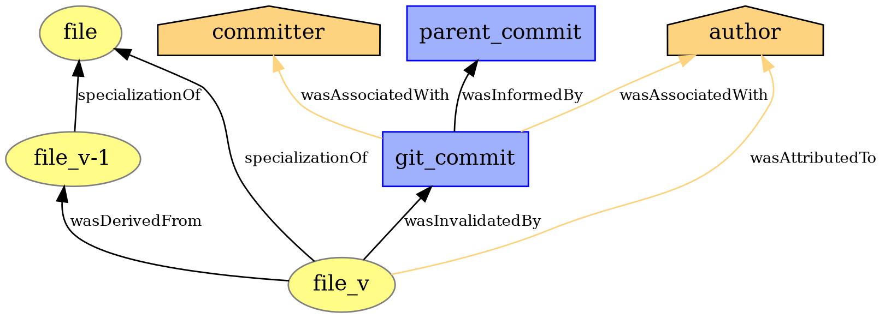
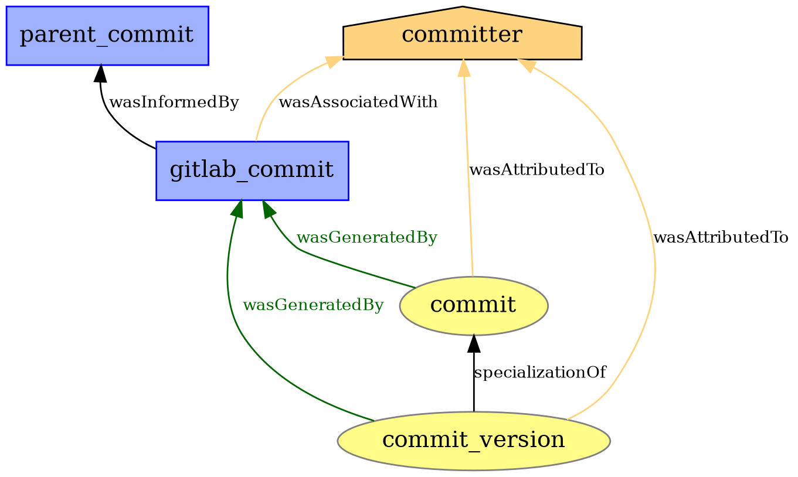
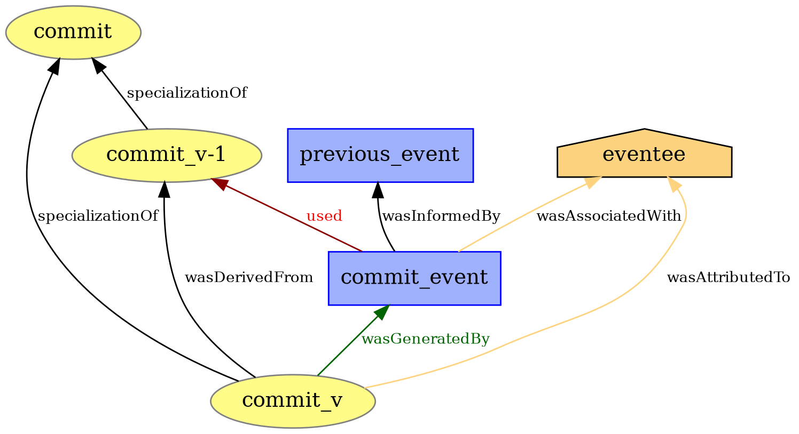

# PROV Models

## Commit Model
#### Commit Model - Add File
A commit adding a new file.  

#### Commit Model - Modify File
A commit modifying an existing file.  

#### Commit Model - Delete File
A commit deleting an existing file.  

#### Commit Model - Create Event
For each commit, create a commit entity to keep track of events that occur on commits.  

#### Commit Model - Update Event
Model for an event occuring on a commit entity.  
Events can be comments, reactions (AwardEmojis), label events, discussions, merge requests, etc.  
A list of events with their respective description will be added soon.

