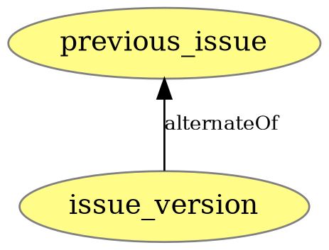

# PROV Models

## Commit Model
#### Commit Model - Add File
A commit adding a new file.  

#### Commit Model - Modify File
A commit modifying an existing file.  

#### Commit Model - Delete File
A commit deleting an existing file.  
The commit only marks an existing file version entity as Invalidated.
It does not add an own file version entity.

#### Commit Model - New Commit
A commit entity and its creation relations.

#### Commit Model - New Commit Event
A commit event occuring on a commit entity.
Events can be comments, reactions (AwardEmojis), label events, discussions, merge requests, etc.  

| Event     | Description                                       | API Resources                             |
|-----------|---------------------------------------------------|-------------------------------------------|
| commented | Added comment to Commit.                          | Non-System Notes from Commit Discussions. |
| mentioned | Commit mentioned in Commit, Issue, Merge Request. | System Notes from Commit Discussions.     |

## Issue Model

### GitLab Issue Events
The GitLab API does not define Issue Events as fine grained as the GitHub API.  
Still, a lot of actions that occur on Issues can be found in other ressources provided by the API.  
The following list describes an extended amount of Issue Events pieced together from multiple API ressources.  

| Event                 | Description                                                  | API Resources                                             |
|-----------------------|--------------------------------------------------------------|-----------------------------------------------------------|
| opened                | Issue opened.                                                | Issue Events or System Note from Issue Discussions.       |
| closed                | Issue closed.                                                | Issue Events or System Note from Issue Discussions.       |
| reopened              | Issue reopened.                                              | Issue Events or System Note from Issue Discussions.       |
| assigned              | Assignee assigned to Issue.                                  | System Note from Issue Discussions.                       |
| unassigned            | Assignee unassigned from Issue.                              | System Note from Issue Discussions.                       |
| mentioned             | Issue mentioned in Commit, Issue, Merge Request.             | System Note from Issue Discussions.                       |
| changed_due_date      | Due date changed.                                            | System Note from Issue Discussions.                       |
| removed_due_date      | Due date removed.                                            | System Note from Issue Discussions.                       |
| changed_description   | Issue description changed.                                   | System Note from Issue Discussions.                       |
| changed_title         | Issue title changed.                                         | System Note from Issue Discussions.                       |
| changed_milestone     | Issue milestone changed.                                     | System Note from Issue Discussions.                       |
| removed_milestone     | Issue milestone removed.                                     | System Note from Issue Discussions.                       |
| added_time_spent      | Added amount of time to time spent tracker.                  | System Note from Issue Discussions.                       |
| subtracted_time_spent | Subtracted amount of time from time spent tracker.           | System Note from Issue Discussions.                       |
| removed_time_spent    | Removed time spent from tracker. Set value to no time spent. | System Note from Issue Discussions.                       |
| changed_time_estimate | Changed time estimate.                                       | System Note from Issue Discussions.                       |
| removed_time_estimate | Removed time estimate.                                       | System Note from Issue Discussions.                       |
| locked                | Issue locked.                                                | System Note from Issue Discussions.                       |
| awarded_emoji         | Emoji awarded to Issue, Note.                                | AwardEmojis on Issues, Notes.                             |
| commented             | Added comment to Issue.                                      | Notes on Issues, Non-System Notes from Issue Discussions. |

#### Issue Model - New Issue
A new Issue.

#### Issue Model - New Issue Event
An issue event occuring on an issue entity.

#### Issue Model - Issue Marked as Duplicate
An issue that got marked as a duplicate. 
Combined Model from New Issue Event and Issue Marked as Duplicate.

