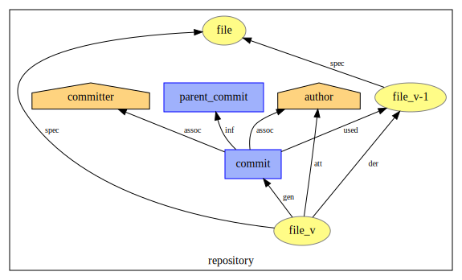
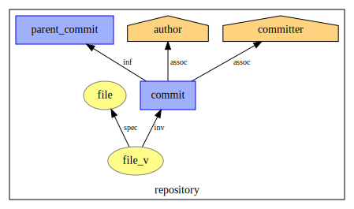
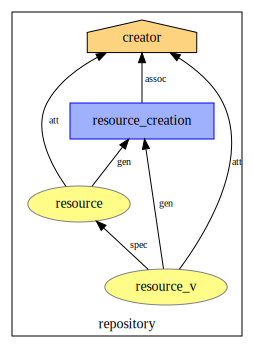
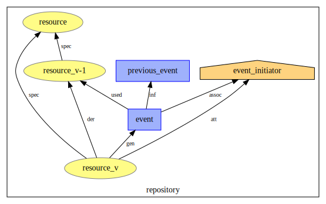

# :art: Provenance Model

### Brew your own plots.

```bash
❯ python plot.py -h
usage: plot.py [-h] [--format FORMAT] directory

Plot PROV models.

positional arguments:
  directory        output file directory

optional arguments:
  -h, --help       show this help message and exit
  --format FORMAT  output format (default .svg)
```

**Example**

```bash
❯ python plot.py --format=pdf pdfs/
Plotting: pdfs/commit-add-file.pdf
Plotting: pdfs/commit-modify-file.pdf
Plotting: pdfs/commit-delete-file.pdf
Plotting: pdfs/resource-creation-commit.pdf
Plotting: pdfs/resource-event.pdf
Plotting: pdfs/resource-creation.pdf
Done.
```

## `git` Commit Model

#### Adding a file


---

#### Modifying a file


---

#### Deleting a file


## The GitLab Resource Model

Most `git`-hosting platforms provide not only a `git` server but also platform specific features.  

For example, GitLab has an issue tracking system, allows discussions for each recorded `git` commit and provides the ability to post, discuss and review merge requests, etc.  

We model these features as event-driven resources.

#### Resource Creation


---

#### Commit Resource Creation - Special Case of Resource Creation


---

#### Resource Events


---

### List of Resource Events

| Event                   | Issue Resource |  Merge Request Resource | Commit Resource |
|:-----------------------:|:--------------:|:-----------------------:|:---------------:|
| comment                 | x              | x                       | x               |
| mention                 | x              | x                       | x               |
| award\_emoji            | x              | x                       | x               |
| award\_note\_emoji      | x              | x                       |                 |
| close                   | x              | x                       |                 |
| open                    | x              | x                       |                 |
| reopen                  | x              | x                       |                 |
| assign                  | x              | x                       |                 |
| unassign                | x              | x                       |                 |
| reassign                | x              | x                       |                 |
| change\_milestone       | x              | x                       |                 |
| remove\_milestone       | x              | x                       |                 |
| add\_spent\_time        | x              | x                       |                 |
| subtract\_spent\_time   | x              | x                       |                 |
| remove\_spent\_time     | x              | x                       |                 |
| lock                    | x              | x                       |                 |
| unlock                  | x              | x                       |                 |
| label                   | x              | x                       |                 |
| unlabel                 | x              | x                       |                 |
| change\_time\_estimate  | x              | x                       |                 |
| remove\_time\_estimate  | x              | x                       |                 |
| move\_to                | x              | x                       |                 |
| move\_from              | x              | x                       |                 |
| target\_branch          |                | x                       |                 |
| wip                     |                | x                       |                 |
| approve                 |                | x                       |                 |
| submit\_review          |                | x                       |                 |
| merge                   |                | x                       |                 |
| due\_date               | x              |                         |                 |
| remove\_due\_date       | x              |                         |                 |
| weight                  | x              |                         |                 |
| clear\_weight           | x              |                         |                 |
| confidential            | x              |                         |                 |
| duplicate               | x              |                         |                 |
| create\_merge\_request? | x              |                         |                 |
| relate?                 | x              |                         |                 |
| move?                   | x              |                         |                 |
