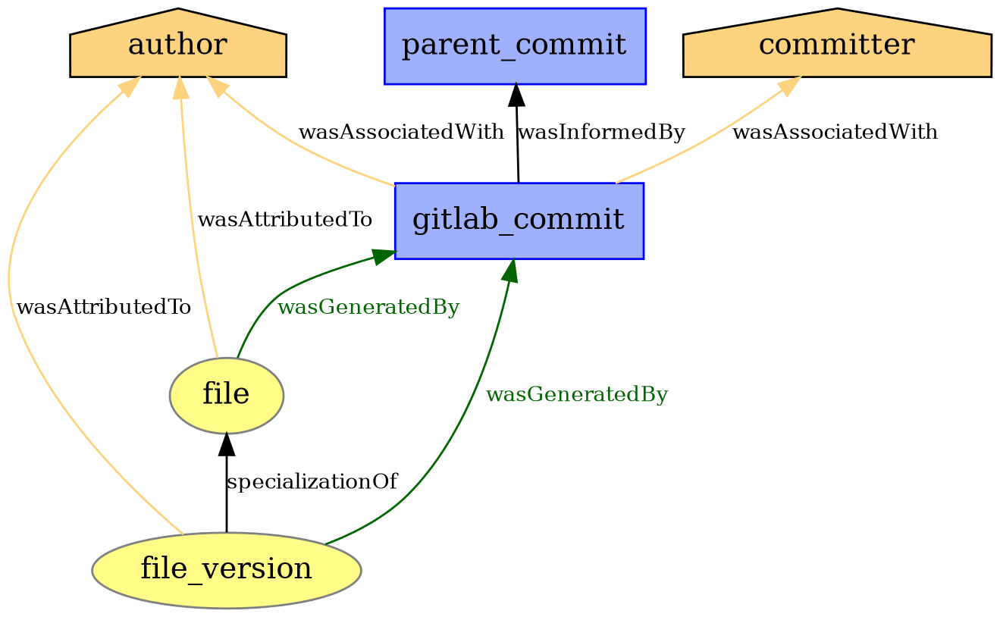
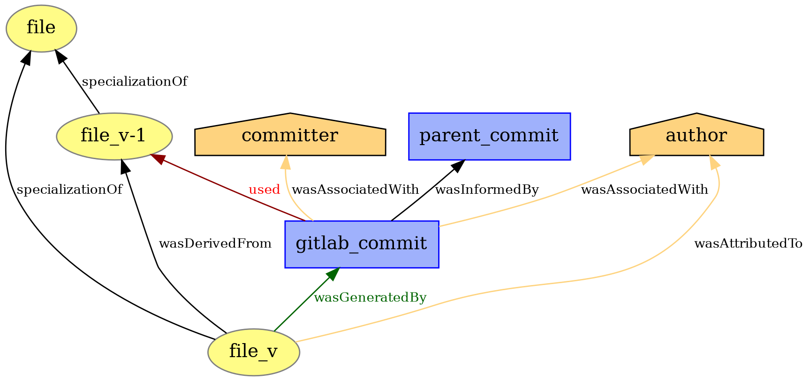
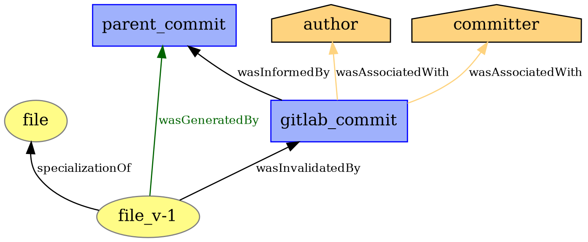
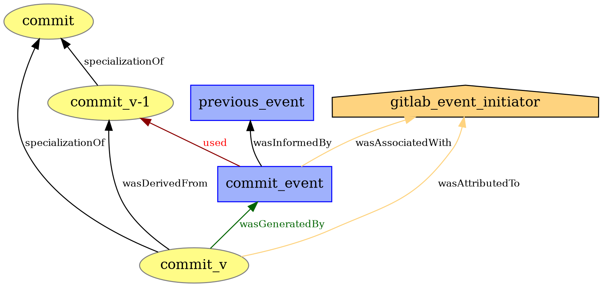
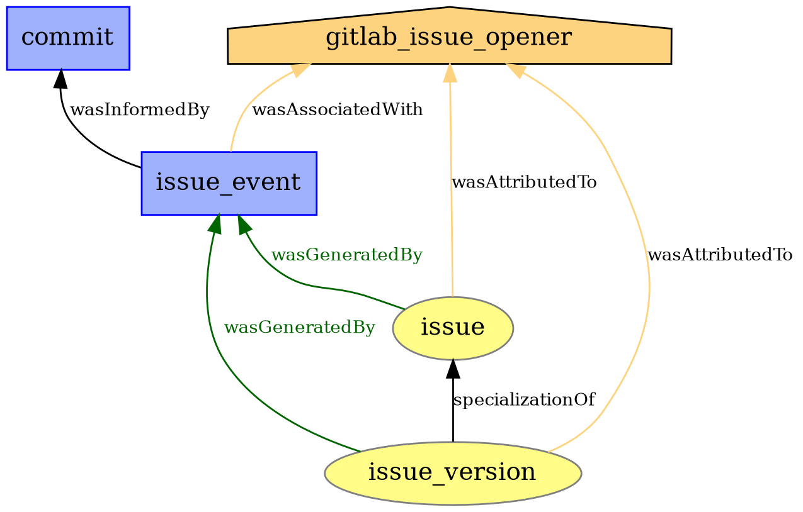
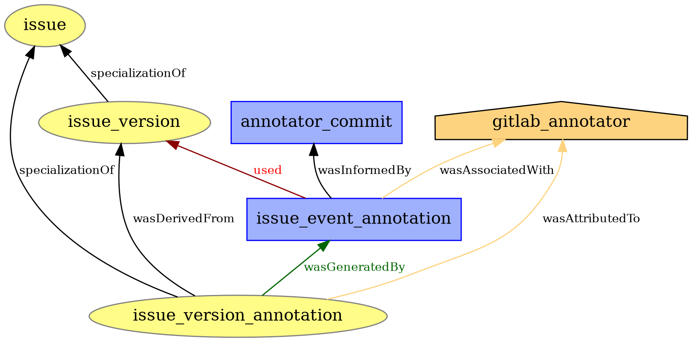

# PROV Models

## Commit Model
#### Commit Model - Add File
A commit adding a new file.  

#### Commit Model - Modify File
A commit modifying an existing file.  

#### Commit Model - Delete File
A commit deleting an existing file.  
The commit only marks an existing file version entity as Invalidated.
It does not add an own file version entity.

#### Commit Model - New Commit
A commit entity and its creation relations.

#### Commit Model - New Commit Event
A commit event occuring on a commit entity.
Events can be comments, reactions (AwardEmojis), label events, discussions, merge requests, etc.  

| Event     | Description                                       | API Resources                             |
|-----------|---------------------------------------------------|-------------------------------------------|
| commented | Added comment to Commit.                          | Non-System Notes from Commit Discussions. |
| mentioned | Commit mentioned in Commit, Issue, Merge Request. | System Notes from Commit Discussions.     |

## Issue Model

### GitLab Issue Events
The GitLab API does not define Issue Events as fine grained as the GitHub API.  
Still, a lot of actions that occur on Issues can be found in other ressources provided by the API.  
The following list describes an extended amount of Issue Events pieced together from multiple API ressources.  

| Event                 | Description                                                  | API Resources                                       |
|-----------------------|--------------------------------------------------------------|-----------------------------------------------------|
| opened                | Issue opened.                                                | Issue Events or System Note from Issue Notes.       |
| closed                | Issue closed.                                                | Issue Events or System Note from Issue Notes.       |
| reopened              | Issue reopened.                                              | Issue Events or System Note from Issue Notes.       |
| added_label           | Label added to Issue.                                        | Issue Label Event                                   |
| removed_label         | Label removed from Issue.                                    | Issue Label Event                                   |
| awarded_emoji         | Emoji awarded to Issue, Note.                                | AwardEmojis on Issues, Notes.                       |
| commented             | Added comment to Issue.                                      | Non-System Notes of Issue Notes.                    |
| assigned              | Assignee assigned to Issue.                                  | System Note from Issue Notes.                       |
| unassigned            | Assignee unassigned from Issue.                              | System Note from Issue Notes.                       |
| mentioned             | Issue mentioned in Commit, Issue, Merge Request.             | System Note from Issue Notes.                       |
| changed_due_date      | Due date changed.                                            | System Note from Issue Notes.                       |
| removed_due_date      | Due date removed.                                            | System Note from Issue Notes.                       |
| changed_description   | Issue description changed.                                   | System Note from Issue Notes.                       |
| changed_title         | Issue title changed.                                         | System Note from Issue Notes.                       |
| changed_milestone     | Issue milestone changed.                                     | System Note from Issue Notes.                       |
| removed_milestone     | Issue milestone removed.                                     | System Note from Issue Notes.                       |
| added_time_spent      | Added amount of time to time spent tracker.                  | System Note from Issue Notes.                       |
| subtracted_time_spent | Subtracted amount of time from time spent tracker.           | System Note from Issue Notes.                       |
| removed_time_spent    | Removed time spent from tracker. Set value to no time spent. | System Note from Issue Notes.                       |
| changed_time_estimate | Changed time estimate.                                       | System Note from Issue Notes.                       |
| removed_time_estimate | Removed time estimate.                                       | System Note from Issue Notes.                       |
| locked                | Issue locked.                                                | System Note from Issue Notes.                       |
| unlocked              | Issue unlocked.                                              | System Note from Issue Notes.                       |
| moved_to              | Issue was moved to other project.                            | System Note from Issue Notes.                       |
| moved_from            | Issue was moved from other project to this project.          | System Note from Issue Notes.                       |

#### Issue Model - New Issue
A new Issue.

#### Issue Model - New Issue Event
An issue event occuring on an issue entity.

